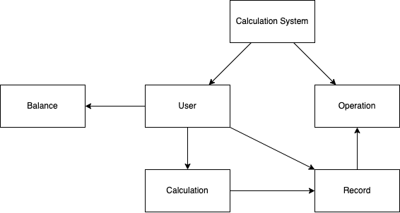
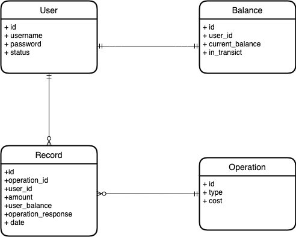

# Calculation System: Domain and Model

## Overview

This document describes the domain and model of the calculation system. The domain
is the set of concepts, terms, and relationships within the problem space. The model
is a representation of the domain that can be used to solve problems.

## Domain

The domain of the calculation system is the set of concepts, terms, and relationships
within the problem space.

 The domain is defined by the following concepts:

- **User**: A user is a person who uses the calculation system to perform calculations.
- **Balance**: A balance is a representation of a user's balance.
- **Operation**: An operation is the representation of a operation that can be performed
  by the calculation system and their associated metadata.
- **Calculation**: A calculation is the representation of a calculation that has been
  performed by the calculation system.
- **Record**: A record is the representation of a the calculation performed by the
  calculation system.

## Model

The model of the calculation system is a representation of the domain that can be used
to solve problems.

The model is defined by the following entities:

- **User**: A user is a person who uses the calculation system to perform calculations.
- **Balance**: A balance is a representation of a user's balance.
- **Operation**: An operation is the representation of a operation that can be performed
  by the calculation system and their associated metadata.
- **Record**: A record is the representation of a the calculation performed by the
  calculation system.
