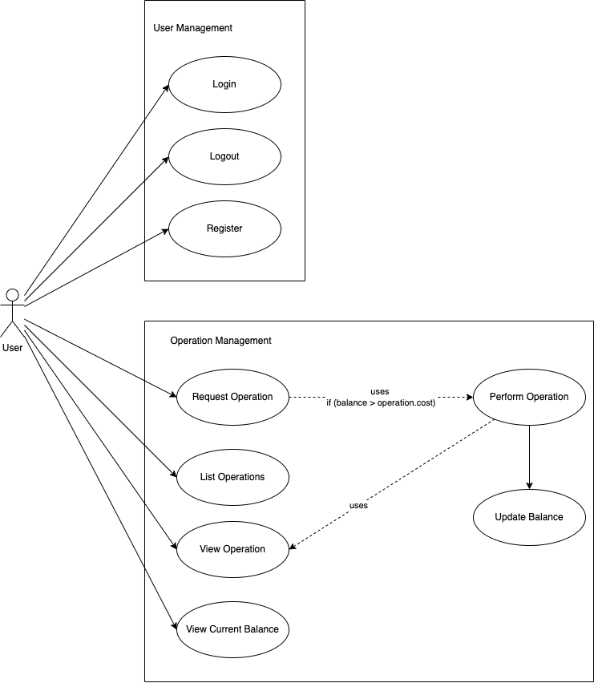

# Calculation Service: Requirements

## Functional Requirements

### User Management

The user management module is responsible for managing the users of the system. It is responsible for creating, updating, and deleting users. It is also responsible for authenticating users and assigning them roles.

#### User Management: Requirements

- [ ] **Register** - A user can register to the system by providing a username, email, and password.
- [ ] **Login** - A user can login to the system by providing a username and password.
- [ ] **Logout** - A user can logout of the system.

### Operation Management

The operation management module is responsible for managing and performing operations. It is responsible for creating, deleting operations. It is also responsible for performing operations and update the user balance.

#### Operation Management: Requirements

##### Operations

- [ ] **Request Operation** - A user can request an operation by providing the operation type and the arguments.
- [ ] **Perform Operation** - The system can perform an operation by providing the operation type and the arguments provided by the user. Also the system can update the user balance after performing the operation and return the result of the operation.
- [ ] **List Operations** - A user can view a list of operations.
- [ ] **View Operation** - A user can view an operation.
- [ ] **Delete Operation** - A user can delete an operation.

###### Operation Types

The operations types that the system can perform are:

- `addition` - The system can perform an addition operation.
- `subtraction` - The system can perform a subtraction operation.
- `multiplication` - The system can perform a multiplication operation.
- `division` - The system can perform a division operation.
- `square_root` - The system can perform a square root operation.
- `random_string` - The system can perform a random string generation.

##### Balance

- [ ] **Update Balance** - The system can update the user balance after performing an operation.
- [ ] **View Current Balance** - A user can view their current balance.

## Non-Functional Requirements

- [ ] **Security** - The system must be secure using authentication and authorization.
- [ ] **Performance** - The system must be able to handle a large number of requests.
- [ ] **Availability** - The system must be available 24/7.
- [ ] **Scalability** - The system must be able to scale horizontally using a load balancer and multiple instances.
- [ ] **Reliability** - The system must be reliable and not lose any data.
- [ ] **Maintainability** - The system must be easy to maintain and update.
- [ ] **Code Quality** - The system must have a high code quality.
- [ ] **Testability** - The system must be easy to test and have a coverage of at least 90%. Also the system must use automated unit tests, integration tests, and end-to-end tests.
- [ ] **Documentation** - The system must be well documented.
- [ ] **Logging** - The system must log all the requests and errors.
- [ ] **CI/CD** - The system must have a CI/CD pipeline.
- [ ] **Containerization** - The system must be containerized using Docker.
- [ ] **Deployment** - The system must be deployed using Cloud Native technologies.
- [ ] **Easy to Setup** - The system must be easy to setup using a single command.
