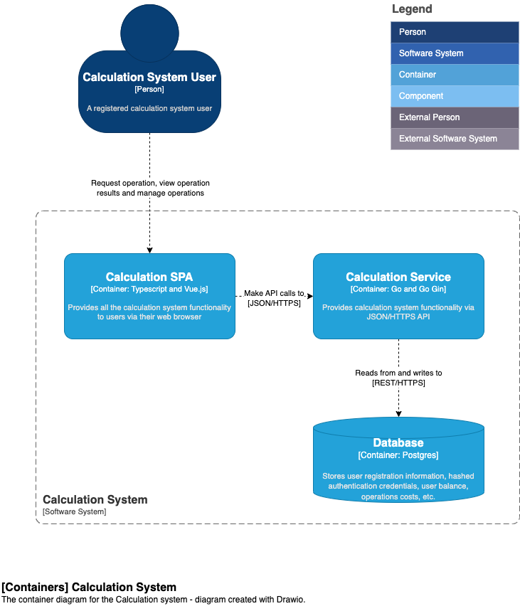
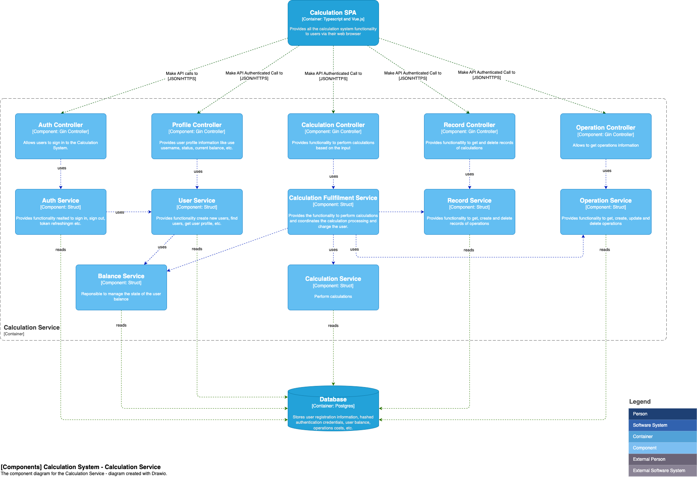

# Calculation System: Architecture

## System Architecture

The system architecture is based on the following components:

- **Users** - The users of the system are the ones who will be using the system to perform operations. They will be able to create, edit, and delete calculations. They will also be able to view the results of operations.
- **Calculation System** - The calculation system is the main component of the system. It will be responsible for performing the calculations and storing the results. It will also be responsible for providing the results to the users.

## Calculation System Container Architecture

The calculation system is composed of the following containers:

- **Calculation Service** - The calculation service is the main component of the system. It will be responsible for performing the calculations and storing the results. It will also be responsible for providing the results to the users.
- **Calculation SPA** - The calculation SPA is Single Page Application that will be used by the users to perform calculations. It will be responsible for providing the user interface for the users to perform calculations.
- **Database** - The database is the component that will be used to store user registration information, user credentials, and calculation results. It will be responsible for storing the data in a secure manner.

## Calculation Service Component Architecture

The application is composed by several components that are responsible for different tasks, each one having a specific responsibility, following SOLID principles and Domain Driven Design.

Each of the components have a description of their responsibilities and the technologies used to implement them in the image above.
